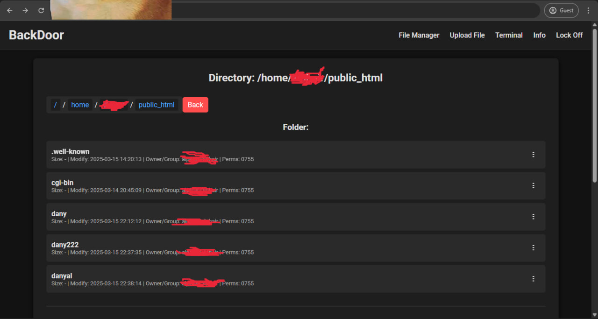
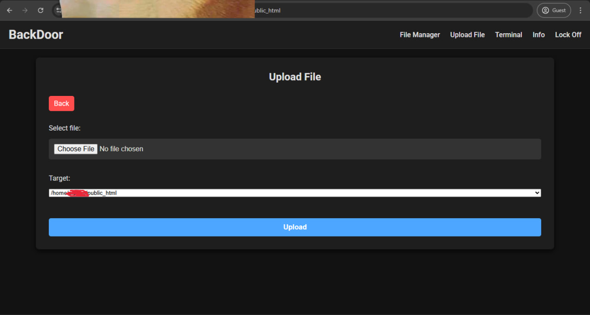

# Stealthy PHP File Manager & Backdoor 🔓🗂️

**⚠️ Disclaimer:**  
This project is intended for educational and research purposes only. Use it on systems you own or where you have explicit permission to test. The author is not responsible for any misuse or damage caused by this tool.

---

### Overview

This project is a stealthy PHP file manager and backdoor that provides covert system access and file management functionality through a simple web interface. It allows you to browse directories, upload, edit, download, rename, move, compress, and delete files. In addition, it features a built-in terminal emulator and a host information page. A unique lock mechanism is also provided to restrict access.

---

### Key Features

- **Directory Browsing & File Listing**  
  - Displays current directories with detailed information such as modification time, file size (or "-" for folders), owner/group, and permissions.  
  - Uses a responsive, minimalist design based on flexbox for file lists.

- **File Operations**  
  - **View / Edit:** Open files directly in the browser using [CodeMirror](https://codemirror.net) for syntax highlighting.  
  - **Download:** Forces file downloads (even HTML files) by reading files in binary mode with proper HTTP headers.  
  - **Rename, Move & Delete:** Easily perform file operations through a contextual dropdown (three-dot menu) for each file.  
  - **Compress:** Create ZIP archives of files or directories for easy transfer and backup.

- **Upload Functionality**  
  - Supports file uploads with the ability to choose a target directory.  
  - Offers a text input to specify a custom target directory if needed.

- **Terminal Emulator**  
  - **Xterm.js Integration:** A built-in web terminal that lets you execute basic commands on the server with live output.  

- **Host Information**  
  - Displays comprehensive server details including OS, PHP version, server IP, disk space, and more in a clean, tabular layout.

- **Lock Mechanism**  
  - Toggle a built-in lock feature to restrict access via a password prompt.  
  - Lock state and password are stored in the browser’s localStorage (for demonstration purposes only).

- **Covert & Stealth Features**  
  - Incorporates graphical effects like a "Matrix Effect" to hide the tool’s true nature.  
  - Uses dark themes and minimalist design for a professional, stealthy appearance.  
  - Can be used as a backdoor for covert access in testing environments (Note: Unauthorized use is illegal).

---

### Technical Details & Analysis

#### How It Works:
- **PHP & File System:**  
  Utilizes standard PHP functions (e.g., `scandir()`, `filemtime()`, `filesize()`) and POSIX functions (if available) to access file metadata.
  
- **Forced File Download:**  
  Sends proper HTTP headers and reads files in binary mode (`rb`) in chunks to ensure proper download behavior.
  
- **File Editing with CodeMirror:**  
  Provides an in-browser editor with syntax highlighting, line numbers, and more.
  
- **Web Terminal with Xterm.js:**  
  Offers a live terminal emulator for executing basic server commands.
  
- **Lock Mechanism:**  
  Implements a simple lock feature via JavaScript using modal dialogs and stores the password in localStorage (not secure for production).

#### Backdoor Analysis:
- **Broad Access:**  
  Enables full file management (view, edit, delete, etc.) and basic command execution, which can be powerful if misused.
  
- **Stealth Design:**  
  Uses graphical effects and a dark, minimal interface to hide its true nature and blend in.
  
- **Security Considerations:**  
  Due to its powerful capabilities, it must be used only in controlled, authorized environments. The localStorage lock is for demonstration and not a production-level security solution.

---

### Usage & Deployment

1. **Deploy:**  
   Upload the PHP file to your server with the correct permissions.
   
2. **Access:**  
   Open the script in your browser to access the file manager, upload, terminal, host info, and lock pages.
   
3. **Lock:**  
   Toggle the lock feature by clicking the "Lock Off" button and set a password to restrict access.
   
4. **File Operations:**  
   Use the dropdown menu (three dots) next to each file or folder to view, edit, rename, move, compress, or delete files.
   
5. **Terminal & Upload:**  
   Execute simple commands via the integrated terminal or upload files as needed.

---

### Contributing & Disclaimer

- **Contributing:**  
  Feel free to fork and contribute to this project—but remember, it is provided solely for educational purposes.
  
- **Legal Warning:**  
  Unauthorized use of this tool for accessing systems without permission is illegal. Use responsibly and ethically.

---

**Happy Hacking! 🚀**  
